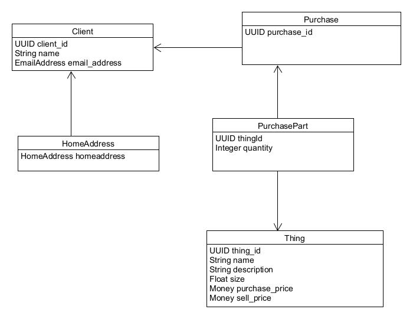
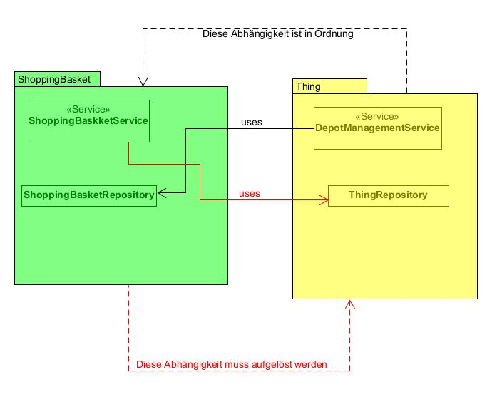
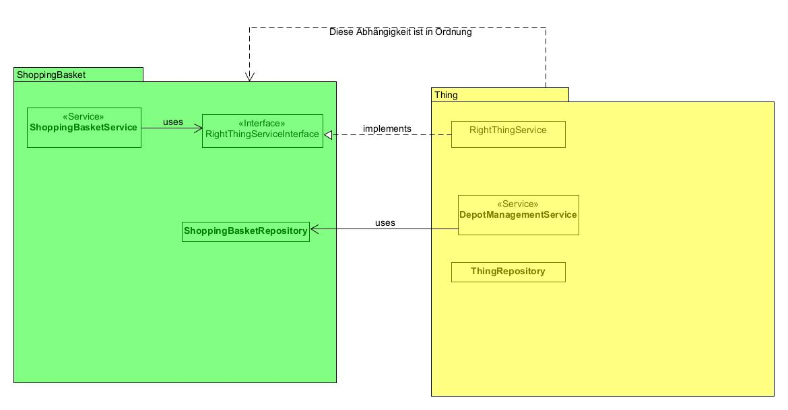

# 🛒 E-Commerce Backend – Modularer Aufbau

Dieses Projekt demonstriert, wie ein einfaches, modular aufgebautes E-Commerce-Backend in Java umgesetzt werden kann. Die Anwendung ist in vier logisch getrennte Module unterteilt:

## 📦 Thing
- Verantwortlich für den Produktkatalog des Online-Shops
- Enthält die zentrale Logik zur Lagerverwaltung

## 👤 Client
- Verwaltung und Speicherung der Kundendaten

## 🧾 Purchase
- Repräsentiert die Kaufhistorie der Kunden

## 🛍️ ShoppingBasket
- Beinhaltet die Geschäftslogik rund um den Warenkorb

---

---

## ❌ Problem: Zyklische Abhängigkeit

Ursprünglich existierte eine **zyklische Abhängigkeit** zwischen den Modulen `Thing` und `ShoppingBasket`.  
Diese enge Kopplung führte zu verminderter Wartbarkeit und erschwerte eine saubere Trennung der Verantwortlichkeiten:

---

## ✅ Lösung: Dependency Inversion Principle

Zur Auflösung des Zyklus wurde das **Dependency Inversion Principle (DIP)** angewendet.  
Dabei definiert eines der Module eine Schnittstelle, die vom jeweils anderen implementiert oder genutzt wird.  
Durch diese Umkehrung der Abhängigkeit wird eine **lose Kopplung** zwischen den Modulen erreicht:

---
## ✅ Tests
Dieses Projekt enthät außerdem umfangreiche automatisierte Tests, um Funktionalität udn Architekturqualität sicherzustellen. Dazu gehören:
- Unit- und Integrationstests aller Kernkomponenten
- Validierung der Geschäftslogik mit Edge Cases
- **Test auf zyklische Abhängigkeiten** zwischen Modulen
- 📁 Der vollständige Testcode befindet sich unter:  
  `src/test/java/com/example/ecommerceapplication`

